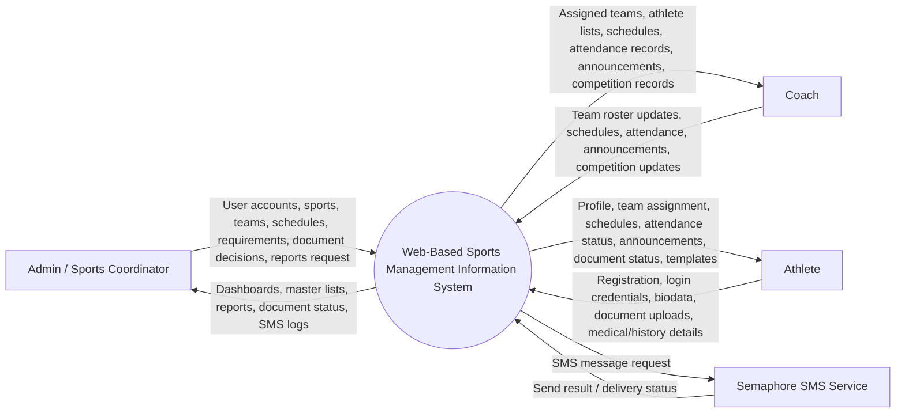

# Chapter 3 Data Flow Diagram

## System

Web-Based Sports Management Information System

## Level 0 DFD - Context Diagram

## Level 1 DFD - Main System Processes

```mermaid
flowchart TB
    Admin[Admin / Sports Coordinator]
    Coach[Coach]
    Athlete[Athlete]
    SMS[Semaphore SMS Service]

    P1((1.0 Manage Access and Users))
    P2((2.0 Manage Athlete Profiles))
    P3((3.0 Manage Sports, Teams, and Rosters))
    P4((4.0 Manage Requirements and Documents))
    P5((5.0 Manage Training Schedules and Attendance))
    P6((6.0 Manage Announcements and SMS))
    P7((7.0 Manage Medical, Competition, and History Records))
    P8((8.0 Generate Dashboards and Reports))

    D1[(D1 Users)]
    D2[(D2 Athletes)]
    D3[(D3 Sports)]
    D4[(D4 Teams)]
    D5[(D5 Team Members)]
    D6[(D6 Requirement Types)]
    D7[(D7 Athlete Documents)]
    D8[(D8 Form Templates)]
    D9[(D9 Training Schedules)]
    D10[(D10 Attendance)]
    D11[(D11 Announcements)]
    D12[(D12 SMS Logs)]
    D13[(D13 Medical Records)]
    D14[(D14 Competitions)]
    D15[(D15 Competition Participants)]
    D16[(D16 Competition Results)]
    D17[(D17 Athlete Histories)]
    D18[(D18 System Settings)]

    Admin -->|Account creation, updates, activation, deactivation| P1
    Athlete -->|Login and registration details| P1
    Coach -->|Login credentials| P1
    P1 -->|Authenticated session and role access| Admin
    P1 -->|Authenticated session and role access| Coach
    P1 -->|Authenticated session and role access| Athlete
    P1 <-->|User account records| D1

    Athlete -->|Biodata and profile photo| P2
    Admin -->|Athlete profile updates and deletion requests| P2
    P2 -->|Profile and athlete master list| Admin
    P2 -->|Own profile details| Athlete
    P2 <-->|Athlete biodata| D2
    P2 -->|Linked athlete user account| D1

    Admin -->|Sports, teams, coaches, roster assignments| P3
    Coach -->|Assigned team roster actions| P3
    P3 -->|Sports list, team list, rosters| Admin
    P3 -->|Assigned teams and athletes| Coach
    P3 <-->|Sport records| D3
    P3 <-->|Team records| D4
    P3 <-->|Team membership records| D5
    P3 -->|Team and sport assignment updates| D2
    P3 -->|Coach lookup| D1

    Admin -->|Requirement types, templates, document approval or rejection| P4
    Athlete -->|Document uploads| P4
    P4 -->|Requirement list, upload status, downloadable templates| Athlete
    P4 -->|Submitted documents and missing requirements| Admin
    P4 <-->|Requirement records| D6
    P4 <-->|Athlete document records| D7
    P4 <-->|Form template records| D8
    P4 -->|Profile-photo document sync| D2

    Admin -->|Training schedule setup and changes| P5
    Coach -->|Schedule updates and attendance marking| P5
    Athlete -->|Schedule and attendance viewing request| P5
    P5 -->|Training calendar and attendance status| Admin
    P5 -->|Assigned schedule and attendance list| Coach
    P5 -->|Own schedules and attendance status| Athlete
    P5 <-->|Training schedule records| D9
    P5 <-->|Attendance records| D10
    P5 -->|Team and member lookup| D4
    P5 -->|Roster lookup| D5
    P5 -->|Athlete lookup| D2

    Admin -->|Announcements and SMS messages| P6
    Coach -->|Team announcements and SMS messages| P6
    P6 -->|Announcements feed| Admin
    P6 -->|Announcements feed| Coach
    P6 -->|Announcements feed| Athlete
    P6 -->|SMS message request| SMS
    SMS -->|Send result| P6
    P6 <-->|Announcement records| D11
    P6 <-->|SMS log records| D12
    P6 -->|Recipient lookup| D1
    P6 -->|Athlete and guardian contact lookup| D2
    P6 -->|Team recipient lookup| D4
    P6 -->|Roster recipient lookup| D5

    Admin -->|Medical records, competitions, participants, results, athlete history| P7
    Coach -->|Competition participants and results| P7
    Athlete -->|Own medical and achievement history request| P7
    P7 -->|Medical, competition, result, and history views| Admin
    P7 -->|Competition and athlete performance views| Coach
    P7 -->|Own medical and achievement history| Athlete
    P7 <-->|Medical records| D13
    P7 <-->|Competition records| D14
    P7 <-->|Competition participant records| D15
    P7 <-->|Competition result records| D16
    P7 <-->|Athlete history records| D17
    P7 -->|Athlete lookup| D2
    P7 -->|Sport lookup| D3
    P7 -->|Coach lookup| D1

    Admin -->|Dashboard and report filters| P8
    Coach -->|Dashboard and team report filters| P8
    Athlete -->|Dashboard request| P8
    P8 -->|Counts, master lists, printable reports, missing requirements, SMS logs| Admin
    P8 -->|Team dashboard, schedules, attendance summaries| Coach
    P8 -->|Personal dashboard summaries| Athlete
    P8 -->|Read users| D1
    P8 -->|Read athletes| D2
    P8 -->|Read sports| D3
    P8 -->|Read teams| D4
    P8 -->|Read documents and requirements| D6
    P8 -->|Read document submissions| D7
    P8 -->|Read schedules| D9
    P8 -->|Read attendance| D10
    P8 -->|Read SMS logs| D12
    P8 -->|Read competitions and results| D14
    P8 -->|Read competition results| D16
    P8 -->|Read athlete histories| D17
    P8 -->|Read app settings| D18
```

## Data Stores Used

| Store | Actual source in code/schema | Contents |
| --- | --- | --- |
| D1 Users | `users` | Login accounts, roles, status, coach contact details |
| D2 Athletes | `athletes` | Athlete biodata, sport/team assignment, status, profile photo, contact and guardian details |
| D3 Sports | `sports` | Sports offered by the school |
| D4 Teams | `teams` | Team records, assigned sport, assigned coach |
| D5 Team Members | `team_members` | Athlete-to-team roster assignments |
| D6 Requirement Types | `requirement_types` | Required and optional document definitions |
| D7 Athlete Documents | `athlete_documents` | Uploaded athlete requirement files and approval status |
| D8 Form Templates | `form_templates` | Downloadable requirement/form templates |
| D9 Training Schedules | `training_schedules` | Training date, time, venue, team, sport, coach, and status |
| D10 Attendance | `attendance` | Athlete attendance per schedule |
| D11 Announcements | `announcements` | Posted announcements by sport or team |
| D12 SMS Logs | `sms_logs` | Sent SMS messages, status, sender, and source |
| D13 Medical Records | `medical_records` | Athlete medical exams, clearances, certificates, physician remarks |
| D14 Competitions | `competitions` | Competition event details |
| D15 Competition Participants | `competition_participants` | Athletes registered in competitions |
| D16 Competition Results | `competition_results` | Rank, medal, score/time, result status |
| D17 Athlete Histories | `athlete_histories` | Athlete achievement and competition history |
| D18 System Settings | `app/config/system_settings.json` | Application name, school details, theme, icon, and display settings |

## Process Basis From Code

- `AuthController`, `UserController`: authentication, registration, and user account management.
- `AthleteController`: athlete biodata, profile photos, athlete deletion, and athlete document lookup.
- `SportController`, `TeamController`: sports, teams, coach assignment, and roster management.
- `DocumentController`: requirement types, athlete document uploads, document approval/rejection, templates, and upload notifications.
- `ScheduleController`, `AttendanceController`: training schedules, team notifications, attendance marking, and schedule completion.
- `AnnouncementController`, `SmsController`, `sms_helper.php`: announcements, SMS sending, and SMS logs.
- `MedicalController`, `CompetitionController`, `AthleteHistoryController`: medical records, competitions, participants, results, SMS for competitions, and athlete achievements.
- `ReportController` and dashboard views: dashboard counts, missing requirements, printable reports, and summaries.
