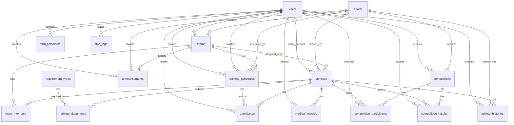

# Chapter 3 Entity Relationship Diagram

## Source Schema

This ERD is based on `database/sports_management.sql`.

## Main Entities

## Tables and Keys

| Table | Primary key | Foreign keys |
| --- | --- | --- |
| `users` | `id` | None |
| `sports` | `id` | None |
| `teams` | `id` | `sport_id -> sports.id`, `coach_id -> users.id` |
| `athletes` | `id` | `user_id -> users.id`, `sport_id -> sports.id`, `team_id -> teams.id` |
| `team_members` | `id` | `team_id -> teams.id`, `athlete_id -> athletes.id` |
| `requirement_types` | `id` | None |
| `athlete_documents` | `id` | `athlete_id -> athletes.id`, `requirement_type_id -> requirement_types.id` |
| `form_templates` | `id` | `uploaded_by -> users.id` |
| `training_schedules` | `id` | `sport_id -> sports.id`, `team_id -> teams.id`, `coach_id -> users.id`, `created_by -> users.id` |
| `attendance` | `id` | `schedule_id -> training_schedules.id`, `athlete_id -> athletes.id`, `marked_by -> users.id` |
| `announcements` | `id` | `sport_id -> sports.id`, `team_id -> teams.id`, `created_by -> users.id` |
| `sms_logs` | `id` | `sent_by -> users.id` |
| `medical_records` | `id` | `athlete_id -> athletes.id`, `recorded_by -> users.id` |
| `competitions` | `id` | `sport_id -> sports.id`, `created_by -> users.id` |
| `competition_participants` | `id` | `competition_id -> competitions.id`, `athlete_id -> athletes.id`, `coach_id -> users.id` |
| `competition_results` | `id` | `competition_id -> competitions.id`, `athlete_id -> athletes.id`, `updated_by -> users.id` |
| `athlete_histories` | `id` | `athlete_id -> athletes.id`, `sport_id -> sports.id`, `created_by -> users.id` |
